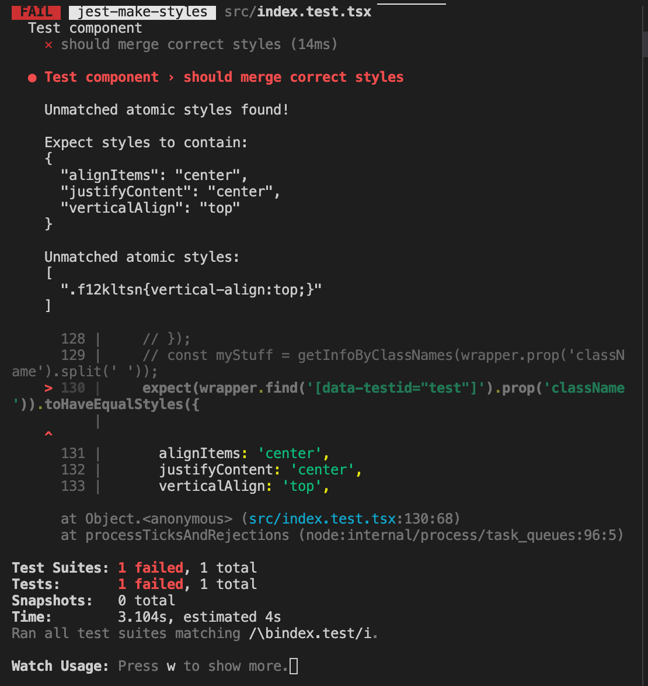
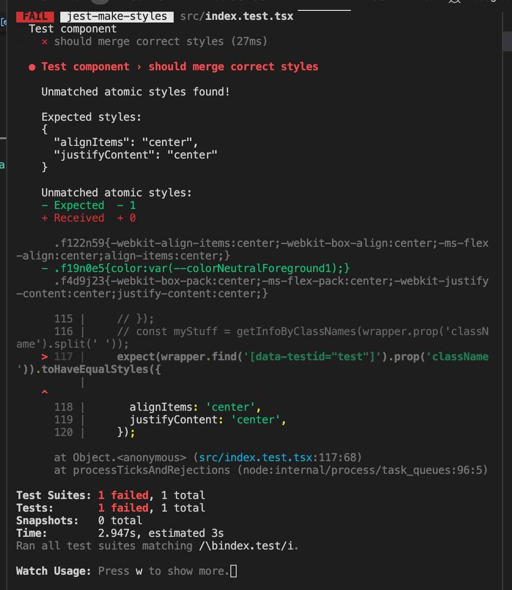

# @fluentui/jest-make-styles

**Jest Make Styles for [Fluent UI React](https://developer.microsoft.com/en-us/fluentui)**

Jest utilities for makeStyles

There are two functions can be used for testing result of mergeClasses.

For this below example component:

```tsx
const useStyles1 = makeStyles({
  root: theme => ({
    color: theme.colorNeutralForeground1,
    alignItems: 'center',
    justifyContent: 'center',
  }),
  isTopAligned: {
    verticalAlign: 'top',
  },
});

const TestComponent = ({ id }: { id?: string }) => {
  const styles1 = useStyles1();
  return <div data-testid={id} className={styles1.root} />;
};
```

1. `toContainStyles` - Test that component contains some styles

```tsx
describe('Test component', () => {
  it('should merge correct styles', () => {
    const wrapper = shallow(<Test id="test" />);
    expect(wrapper.find('[data-testid="test"]').prop('className')).toContainStyles({
      alignItems: 'center',
      justifyContent: 'center',
      verticalAlign: 'top', // ❌  TestComponent does not have this style
    });
  });
});
```

Result:



1. `toHaveEqualStyles` - Test that all styles are present

```tsx
describe('Test component', () => {
  it('should merge correct styles', () => {
    const wrapper = shallow(<Test id="test" />);
    expect(wrapper.find('[data-testid="test"]').prop('className')).toHaveEqualStyles({
      // ❌ missing color style
      alignItems: 'center',
      justifyContent: 'center',
    });
  });
});
```

Result:



If the component uses

```tsx
<div data-testid={id} className={mergeClasses(styles1.root, styles1.isTopAligned)} />
```

The above test will pass.
